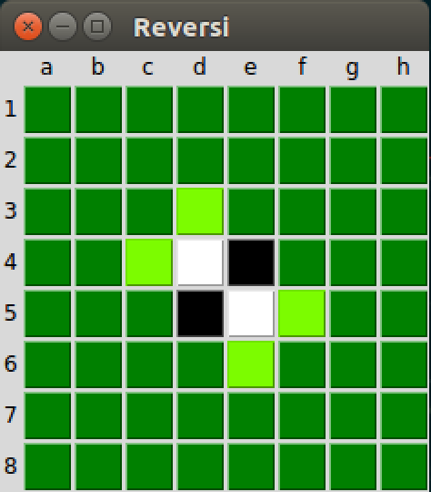
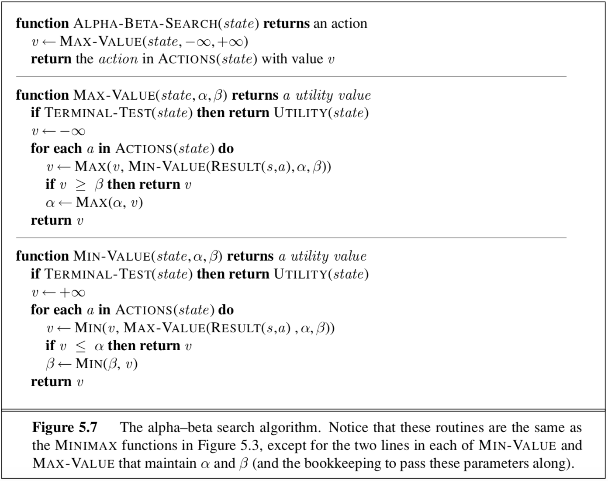

# Reversi

This is a Python program for playing **Othello** (or **Reversi**) against an AI player.

This project is developed on Ubuntu 16.04 LTS.

This is Jingran's mini-project for **COMP3270 Artificial Intelligence** at the University of Hong Kong.

## Requirements

- [Python 3.6](https://www.python.org/downloads/release/python-363/)
- [TkInter](https://www.python.org/download/mac/tcltk/)

## How to Run

1. Download all the files [here](https://github.com/JRChow/Reversi).

2. Unzip.

3. Open Terminal, `cd` into this directory and type:

   ```shell
   python3.6 reversi_gui.py
   ```

> Please note that a command-line version of the game is also available. To run the command-line version, type:
>
> ```Shell
> python3.6 reversi_cmd_line.py
> ```

## Rules

### Basic Rules

Each **reversi piece** has a black side and a white side. On your turn, you place one piece on the board with your color facing up. You must place the piece so that an opponent's piece, or a row of opponent's pieces, is flanked by your pieces. All of the opponent's pieces between your pieces are then turned over to become your color. 

### Aim of the Game

The object of the game is to own more pieces than your opponent when the game is over. The game is over when neither player has a move. Usually, this means the board is full. 

### Start of the Game

The game is started in the position shown below on a reversi board consisting of 64 squares in an 8x8 grid. 



### Playing the Game

A move consists of placing one piece on an empty square.	

#### Capture

You can capture vertical, horizontal, and diagonal rows of pieces. Also, you can capture more than one row at once. 

### End of the Game

The game ends when: 

- One player wins, by making his color dominant on the board.The players agree to finish the game (as a resignation, or a draw).
- One player wins, by making his color dominant on the board.The players agree to finish the game (as a resignation, or a draw).

## Methodology

### Search Engine

Minimax procedure with alpha-beta pruning.

### Alpha-beta Pruning

The AI employs the alpha-beta pruning algorithm described in Chapter 5 of the book *Artificial Intelligence: A Modern Approach*. The detailed pseudocode is listed below:



#### Cutting Off Search

To limit the time the AI spends on searching, a **cutoff test** is introduced. So when it is appropriate to cut off the search, it'll call the heuristic function to choose a move.

The specific cutoff test for this application is easy: ***the depth of the search is limited to 5 levels.*** In other words, ***the number of look ahead steps is 5*** by default. If the depth from the current state to the terminal state is less than 5, then the cutoff test is simply the terminal test.

Note the depth limit can be modified at line 66 in `reversi_logic.py`.

### Heuristics Applied

#### Coin Difference

Apparently, for a player, the more coins he has (and the fewer coins his opponent has), the better. 


But note that the weight assigned to this heuristic should not be heavy, because the difference in coins fluctuates intensely and frequently, due to the nature of the game, and only in the very end does the difference in coins matters. 

#### Choice Difference

This heuristic aims to increase one's flexibility in terms of choices and constrain the opponent's choices of valid moves.


#### Corner Difference

From the experience of playing the game, we learned that corners are *crucial* because once a corner is captured, it cannot be flipped. Furthermore, a player can build up stable coins around the corner. This is how one usually wins. Thus, *this heuristic should receive a **heavy weighting**.*


### Evaluation Function


## Future Releases

- Stability
- Graphical Interface
- Database for beginning of game and end games.

## Reference

http://www.flyordie.com/games/help/reversi/en/games_rules_reversi.html

AIMA

https://kartikkukreja.wordpress.com/2013/03/30/heuristic-function-for-reversiothello/